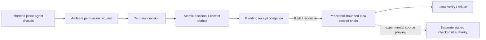

# OMNIS KEY Open Source V1 — Release Specification

**Status:** DRAFT FOR CAPTAIN CALL  
**Conditional gate date:** 2026-07-29  
**Release vehicle:** `jourdanlabs/omniscode`  
**Frozen implementation base:** `adea0588877f490e7304a33197fd520f92355489`  
**Base tree:** `2844f16b76d6b0544f7c0f81f2c581f231519e8f`  
**Proposed release label:** **OMNIS KEY Local Integrity V1 — Developer Preview**  
**Proposed tag:** `omnis-key-foundation-v0.1.0`

This specification defines the smallest public OMNIS KEY release that is
useful, differentiated, reproducible, and honest on 2026-07-29.

It is a release specification, not permission to merge, tag, publish binaries,
install privileged services, or activate checkpoint authority.

## 0. Captain decision requested

Approve this document as the implementation contract for the overnight build.
That call authorizes focused source work and local verification only. It does
not authorize a tag, default-branch switch, GitHub settings mutation, Release,
announcement, installer, or activation; each external mutation remains on the
promotion ladder in Section 10.1.

The recommended decision is:

- release from the already-public `jourdanlabs/omniscode`, never from a
  private catalogue repository;
- ship one narrow, real differentiator—terminal safety decisions with durable
  receipt obligations and fail-closed reconciliation—on the inherited jcode
  chassis with explicit attribution;
- make the release source-only and label checkpoint authority experimental;
- spend the overnight effort on four P0s: fork sovereignty, a coherent
  `omnis-key` surface, honest open-source identity, and fail-closed CI/release
  evidence;
- if any gate remains open, publish a development update and demonstration
  instead of mislabeling the candidate V1.

## 1. The release proposition

The public V1 may claim exactly this:

> OMNIS KEY Local Integrity V1 is a transparently attributed fork of jcode
> whose inherited upstream code and JourdanLabs-authored modifications are
> offered under MIT.
> It adds per-record-bounded, idempotent, hash-linked local evidence receipts.
> A terminal ambient-permission decision processed by the SafetySystem
> atomically commits the decision and a receipt obligation. Receipt failure
> leaves that obligation pending; reconciled status requires the exact matching
> receipt. Receipt and bound safety state refuse malformed, partial, internally
> inconsistent, orphaned, drifted, or mismatched bytes.

The V1 source tree also contains an Ed25519-signed kernel designed for a
separately owned checkpoint authority on macOS. That kernel is an
**experimental source preview**. V1 does not install, provision, activate, or
claim an operating checkpoint service or operational owner separation.

Third-party fonts, media, icons, and vendored material remain under their
identified licenses. The release cannot make a repository-wide MIT claim until
that inventory is complete.

### 1.1 The one-sentence launch line

> **A high-capability coding-agent harness where terminal ambient-permission
> decisions create durable receipt obligations—and reconciled integrity
> refuses mismatched receipt and safety state instead of silently reseeding
> it.**

### 1.2 What “V1” means here

“V1” names the first coherent public product contract. The software version is
`0.1.0` because installation, sovereign identity, independently validated
evidence, and activated checkpoint authority remain outside this release.

This is not a semantic-version `1.0.0` stability promise.

### 1.3 V1 architecture



The solid path is the public V1. A receipt-write failure stops at the pending
obligation until reconciliation succeeds. The dotted checkpoint path is
included source, not an installed or activated product path.

## 2. Measured baseline

The repository is already public. Tomorrow is the target for an intentional
product launch, not first disclosure.

The GitHub default branch currently remains the inherited jcode `master`.
The OMNIS source candidate exists on `codex/omnis-key-receipt-core`.

### 2.1 Component map

| Component | State | Public V1 treatment |
|---|---|---|
| Inherited jcode TUI, providers, sessions, tools, memory, swarm | **REAL — UPSTREAM** | Credit jcode explicitly; do not present these as JourdanLabs inventions |
| Bounded local receipt schema and hash chain | **REAL — OMNIS** | Ship and demonstrate |
| Idempotent append and exact replay | **REAL — OMNIS** | Ship and demonstrate |
| Malformed/partial/internal-inconsistency local-chain refusal | **REAL — OMNIS** | Ship and adversarially demonstrate |
| Atomic terminal safety-decision + receipt-obligation state | **REAL — OMNIS** | Ship with exact claim ceiling |
| Safety-receipt reconciliation and orphan/drift refusal | **REAL — OMNIS** | Ship and test |
| Signed checkpoint daemon/client/protocol/store kernel | **REAL SOURCE** | Mark experimental and inactive |
| Checkpoint service account, keys, installer, launchd, activation | **ABSENT** | Must remain absent from V1 |
| Independent validation of evidence truth | **ABSENT** | Never claim |
| Universal interception of every model/tool/action | **ABSENT** | Never claim |
| General provider-turn or completed-task receipts | **ABSENT** | Roadmap |
| Signed soul loading and negative-axiom enforcement | **ABSENT FROM THIS REPO** | Roadmap; import no private identity artifacts |
| Hostile same-UID rollback resistance | **ABSENT** | Explicit non-claim |
| Encrypted local history | **ABSENT** | Explicit plaintext-at-rest warning |
| OMNIS-owned installer, updater, telemetry, account, discovery, support | **ABSENT** | Disable inherited endpoints; do not advertise substitutes |
| OMNIS-branded executable and help surface | **ABSENT** | P0 release work |
| OMNIS README, security policy, contribution path, CI receipt | **ABSENT** | P0 release work |

## 3. Hard product boundaries

### 3.1 V1 does not claim

- that cited evidence is true;
- that every agent turn or tool execution is receipted;
- that receipt creation authorizes or executes an action;
- that the local chain defeats a malicious process running as the same UID;
- that deletion or rollback to any internally valid prefix, an absent ledger,
  or coherent same-UID rehashing is detected without a separately retained
  checkpoint;
- that per-record and per-frame bounds impose a total ledger or total state
  size bound;
- that the checkpoint authority is installed or operating;
- that checkpoint activation, keys, users, groups, launchd, or host topology
  exist;
- Windows crash-durable receipt publication or checkpoint support;
- encrypted state, hardware roots, remote transparency, enterprise identity,
  regulatory compliance, production availability, or production suitability;
- provider, Door, publication, autonomous dispatch, or LIVE authority;
- that inherited jcode benchmarks have been independently reproduced by
  JourdanLabs.

### 3.2 Local privacy boundary

Receipt event IDs, subjects, evidence digests, ledger paths, and checkpoint
metadata are stored in plaintext. Safety state may also contain action,
description, rationale, and context fields. V1 does not encrypt them.

Default-created OMNIS state must be owned by the invoking user, stored beneath
a private `0700` directory, written as `0600`, and refused if the path or any
reviewed component is a symlink or carries an unexpected ACL.

V1 does **not** expose a public `--ledger` path override. Public receipt
commands use one canonical user-local state path. Tests and the fixture-only
demo may inject an isolated path through internal APIs that are not exposed by
the shipped CLI.

The README and CLI must warn users not to place secrets in receipt event IDs or
subjects and not to treat the local ledger as a secret vault.

### 3.3 Private catalogue boundary

No private soul, memory, operator, customer, credential, ledger, receipt, trust,
or activation artifact may be copied into this repository.

Private repositories must not be made public as part of this release. If a
future public identity example is needed, it must be a new synthetic fixture
with a separately reviewed provenance.

### 3.4 Platform boundary

The V1 integrity claim is Unix-scoped and must be reproduced on macOS and
Linux. The checkpoint source preview is macOS-only. Windows may retain
inherited jcode compatibility, but V1 makes no OMNIS durability or checkpoint
claim there.

## 4. Release vehicle and branch model

1. Preserve `master` as the upstream jcode mirror point.
2. Create `codex/release-omnis-key-foundation-v0.1.0` from the frozen OMNIS
   base.
3. Land all launch work on that release branch through reviewed, focused
   commits.
4. Create `main` from the final gated release candidate.
5. Make `main` the GitHub default only after the final gate and Captain’s call.
6. Protect `main`; require the OMNIS V1 CI checks, block force-pushes and
   deletion, and do not add an unsatisfiable pull-request-review rule while the
   repository has only one eligible GitHub identity. Add a review requirement
   when a second eligible identity or team exists.
7. Never force-push the gated release identity.

The Toph CLEAR on `adea0588…` remains valid only for that source candidate.
Every launch change creates a new candidate and requires a new exact-identity
review.

## 5. Fork sovereignty — P0

No public V1 may silently call, update from, install from, or report to upstream
jcode infrastructure. This rule applies to every executable and shared runtime
distributed from the release, including the compatibility `jcode` binary—not
only the new `omnis-key` entrypoint.

### 5.1 Required code changes

- Disable anonymous telemetry globally by default.
- Remove compiled/default `telemetry.jcode.sh` destinations from every
  distributed runtime path.
- Disable sponsored discovery globally by default.
- Require an explicit user-supplied endpoint before any discovery network
  request.
- Disable release auto-update and update checks in every distributed
  executable.
- Prevent every shipped binary from replacing itself with bytes from
  `1jehuang/jcode`.
- Point self-development clone behavior to the JourdanLabs fork or disable it
  for V1.
- Disable inherited jcode account, subscription, support, install, and release
  surfaces in every shipped executable path.
- Intercept **every** OMNIS integrity command before logging, config migration,
  hook/plugin loading, telemetry, updater, provider registration, or other
  ambient startup—not only checkpoint commands.
- Include valid commands, help/version forms, parser failures, and malformed
  request IDs in that isolated path.
- Ensure `omnis-key --help`, `--version`, receipt status, receipt verify,
  receipt record, reconciliation, and the offline demo perform no unexpected
  network or user-home writes.

### 5.2 Required repository changes

- Replace or disable inherited installers that download upstream jcode.
- Delete, rename out of `.github/workflows`, or safely adapt every inherited
  tag-, release-, schedule-, deployment-, TestFlight-, Homebrew-, AUR-, and
  Discord-triggered workflow before any tag or GitHub Release is created.
- Quarantine inherited `RELEASING.md`, `scripts/quick-release.sh`, release-note
  generators, installers, and release scripts that encode upstream
  publication.
- Do not ship a binary installer in V1.
- Do not create any tag or publish any GitHub Release while an inherited
  release-event workflow remains active.

### 5.3 Acceptance

- A clean temporary `HOME`, `JCODE_HOME`, XDG state/config roots, current
  directory, and operator-state snapshot remain byte-identical after read-only
  commands.
- Process instrumentation records zero DNS, `AF_INET`, or `AF_INET6` attempts
  for both `omnis-key` and `jcode` across first run, no-argument startup, help,
  version, parse error, every integrity command, and the demo. The demo also
  records zero checkpoint `AF_UNIX` attempts.
- Static inspection finds no runtime-default updater, telemetry, discovery,
  account, installer, or self-dev target owned by upstream.
- A network-denied success is supporting evidence, not proof of zero attempted
  networking; the instrumentation receipt is mandatory.
- An explicit provider command may use the provider selected by the user; that
  is not ambient network behavior.
- The local `upstream` Git remote is fetch-only or has an intentionally disabled
  push URL in contributor setup instructions.

### 5.4 Exact write manifest

The implementation and tests must bind these allowed effects:

| Command class | Allowed writes |
|---|---|
| help, version, parse error | none |
| `demo integrity` | only a symlink-safe private temporary root created by the command and removed on exit |
| receipt `status` and `verify` | none; no lock, migration, config, or ledger creation |
| receipt `record` | only the canonical validated ledger parent and its lock/temp/final files |
| `reconcile-safety` | only the named, validated safety-state and receipt paths plus their lock/temp/commit markers |
| checkpoint status/refusal while inactive | none; no production-state creation |

Every test snapshots all relevant state roots and the working directory before
and after the command. An intentional write outside this table requires a new
spec and gate.

## 6. Product surface — P0

### 6.1 Canonical command

Add a non-publishable workspace package named `omnis-key-cli`, version `0.1.0`,
as the canonical and sole source of the public product version. It may depend
on the inherited root package, which remains version `0.61.2`.

Every workspace package must explicitly inherit or declare the correct
`license`, `repository`, and `homepage` metadata; workspace metadata is not
assumed to propagate automatically. Every package outside an explicit,
reviewed publication allowlist must set `publish = false`. The V1 allowlist is
empty. Machine acceptance must report zero publishable or
metadata-incomplete workspace packages.

Add an `omnis-key` executable as the public entrypoint.

Keep the inherited `jcode` executable as a compatibility surface in V1. Do not
pretend the internal crate/config namespace has already been fully migrated.
It must pass the same global sovereignty and no-ambient-effect tests as
`omnis-key`.

Required output:

```text
omnis-key 0.1.0
jcode compatibility base 0.61.2
```

Required machine-readable output:

```bash
omnis-key version --json
```

The version source must match the tag, release notes, release manifest, and
archive metadata exactly.

### 6.2 Integrity command language

Expose the existing OMNIS subcommands through this frozen public grammar:

```text
omnis-key receipts status [--json]
omnis-key receipts verify [--json]
omnis-key receipts record --event-id ID KIND SUBJECT \
  --evidence-sha256 HEX [--json]
omnis-key receipts reconcile-safety [--json]
```

`--ledger` is not accepted by the public V1 CLI.

The public recorder uses the fixed claim ceiling `local-record`. It does not
accept a caller-selected value such as `local-verification`, which would imply
that user input had been independently verified.

The existing `omnis` spelling may remain as a compatibility alias.

Checkpoint commands must be clearly grouped as experimental:

```text
omnis-key checkpoint anchor --request-id ID [--json]
omnis-key checkpoint verify-anchored [--json]
```

They must refuse cleanly when activation is absent and must not imply that V1
can provision it.

All machine-readable output uses `schemaVersion: 1`. Freeze these exit-code
classes and document every command:

| Code | Meaning |
|---:|---|
| `0` | requested operation completed; a positive receipt result requires a nonempty chain and named head |
| `2` | command usage or input-shape error |
| `3` | integrity refusal, mismatch, malformed state, or `EMPTY / NOT YET EVIDENCED` |
| `4` | optional authority or capability is unavailable, including inactive checkpoint authority |

No ordinary refusal emits a success-shaped JSON object.

#### Machine-readable contract

For a recognized command invoked with `--json`, stdout contains exactly one
newline-terminated object with exactly these top-level fields:

```json
{
  "schemaVersion": 1,
  "command": "receipts.verify",
  "ok": true,
  "code": "RECEIPT_CHAIN_VALID",
  "data": {}
}
```

`data` is the command-specific object below or `null` where stated. No JSON
response contains a ledger path, home path, username, hostname, UID/GID,
socket path, raw safety rationale/context, or implementation backtrace.
Diagnostic prose goes to stderr in human mode and begins with the same stable
code. A parser failure before a command is recognized may emit no JSON, but
still exits `2` through the isolated no-network/no-write startup path.

| Command | Success `code` and exact `data` keys | Refusal `code` |
|---|---|---|
| `version` | `VERSION`; `productVersion`, `compatibilityBaseName`, `compatibilityBaseVersion` | — |
| `receipts.status` | `RECEIPT_CHAIN_VALID`; `state`, `entryCount`, `headSha256` | `EMPTY_NOT_YET_EVIDENCED` with the same keys and `headSha256: null`; `RECEIPT_CHAIN_INVALID`; `RECEIPT_STATE_UNSAFE` |
| `receipts.verify` | `RECEIPT_CHAIN_VALID`; `state`, `entryCount`, `headSha256` | `EMPTY_NOT_YET_EVIDENCED` with the same keys and `headSha256: null`; `RECEIPT_CHAIN_INVALID`; `RECEIPT_STATE_UNSAFE` |
| `receipts.record` | `RECEIPT_APPENDED` or `RECEIPT_EXISTING`; `disposition`, `sequence`, `receiptSha256`, `claimCeiling` | `RECEIPT_EVENT_CONFLICT`; `RECEIPT_STATE_UNSAFE`; `INVALID_RECEIPT_INPUT` |
| `receipts.reconcile-safety` | `SAFETY_RECONCILED` or `SAFETY_ALREADY_RECONCILED`; `pendingBefore`, `appended`, `existing`, `pendingAfter` | `SAFETY_RECEIPT_DRIFT`; `SAFETY_STATE_INVALID` |
| `checkpoint.anchor` | `CHECKPOINT_ANCHORED` or `CHECKPOINT_EXISTING`; `disposition`, `checkpointSequence`, `checkpointSha256`, `observedReceiptSequence`, `observedReceiptHeadSha256` | `CHECKPOINT_AUTHORITY_UNAVAILABLE`; `CHECKPOINT_REFUSED` |
| `checkpoint.verify-anchored` | `CHECKPOINT_VERIFIED`; `checkpointSequence`, `checkpointSha256`, `observedReceiptSequence`, `observedReceiptHeadSha256` | `CHECKPOINT_AUTHORITY_UNAVAILABLE`; `CHECKPOINT_SIGNATURE_INVALID`; `CHECKPOINT_LOCAL_ROLLBACK_DETECTED`; `CHECKPOINT_CHAIN_DIVERGED` |
| `demo.integrity` | `DEMO_INTEGRITY_PASSED`; `fixtureOnly`, `firstAppend`, `exactReplay`, `validChain`, `tamperedCopyRefused`, `tamperRefusalCode`, `executionAuthorized` | `DEMO_INTEGRITY_FAILED` |

The table is exhaustive for public V1. `state` is exactly `VALID` or `EMPTY`;
`disposition` is exactly `APPENDED` or `EXISTING`; counts and sequences are
nonnegative JSON integers; every `*Sha256` is lowercase 64-character hex
without a prefix; `claimCeiling` is exactly `local-record`. Refusals not
explicitly given a `data` shape use `data: null`.

All success codes exit `0`; `INVALID_RECEIPT_INPUT` exits `2`; integrity and
state refusals exit `3`; `CHECKPOINT_AUTHORITY_UNAVAILABLE` exits `4`.

### 6.3 Credential-free hero demonstration

Ship one command:

```text
omnis-key demo integrity
```

The demo must:

1. create a symlink-safe, owner-private temporary state directory and install
   cleanup before any fixture write;
2. hash synthetic evidence in-process without shell hooks, plugins, config, or
   inherited startup;
3. append one bounded local receipt;
4. replay the exact same event and receive `existing`, not a duplicate;
5. verify the valid chain;
6. preserve the original fixture, copy it, and mutate only the
   nonauthoritative copy;
7. invoke the production verifier and demonstrate its concrete stable refusal
   code against the mutated copy;
8. never discover, enumerate, open, or hash operator-state roots. An external
   acceptance harness—not the production demo—must hash controlled sentinel
   roots before and after and instrument filesystem access to prove the demo
   reaches only its self-created private temporary root;
9. make no provider, telemetry, discovery, update, or checkpoint call;
10. run under hostile `HOME`, XDG, `JCODE_HOME`, PATH, config, hook, and plugin
    environment fixtures;
11. label itself `fixture_only: true`;
12. clean up on normal success, handled refusal/error, unwinding panic, and
    catchable termination signals. An uncatchable crash remnant must remain
    private, fixture-only, outside operator state, and safely reclaimable on
    the next run;
13. redact absolute paths, usernames, hostnames, numeric UIDs/GIDs, and other
    host-derived identifiers from public output.

Machine-readable mode:

```text
omnis-key demo integrity --json
```

Expected assertions:

```json
{
  "schemaVersion": 1,
  "command": "demo.integrity",
  "ok": true,
  "code": "DEMO_INTEGRITY_PASSED",
  "data": {
    "fixtureOnly": true,
    "firstAppend": "APPENDED",
    "exactReplay": "EXISTING",
    "validChain": true,
    "tamperedCopyRefused": true,
    "tamperRefusalCode": "RECEIPT_CHAIN_INVALID",
    "executionAuthorized": false
  }
}
```

An absent ledger may be internally represented as a valid empty chain, but the
public surface must not display that as positive evidence. A positive demo or
verification badge requires at least one entry and a named head. Empty state
must render as `EMPTY / NOT YET EVIDENCED`.

### 6.4 Real user journey

The README must separate two lanes:

**Integrity lane, supported and credential-free**

```bash
omnis-key demo integrity
```

The demo is ephemeral and deletes its temporary ledger. It must not be followed
by status/verify examples that imply the same state persists. A separate
operator-ledger example may show `record`, `status`, and `verify` against the
canonical user-local path with an explicit plaintext warning.

**Agent lane, inherited from jcode**

```bash
omnis-key
```

The README must say that ordinary agent turns are not automatically receipted
as complete runs in V1. Only the exact implemented terminal permission
decisions and explicit receipt operations earn OMNIS receipts.

If the inherited agent lane remains advertised, CI must execute a
credential-free PTY smoke test for every shipped executable. It must prove
startup emits a usable first frame and exits cleanly without provider spend,
credentials, telemetry, updates, discovery, account access, or support calls.
If that cannot be proven, V1 advertises only the local integrity CLI.

## 7. Identity, rights, and public documentation — P0

### 7.1 README

Replace the inherited jcode landing page with an OMNIS README containing:

- the one-sentence launch line;
- a 30-second credential-free demo;
- the exact V1 proposition and claim ceiling;
- REAL / EXPERIMENTAL / ABSENT component status;
- architecture;
- source-build instructions;
- local-state and plaintext warnings;
- explicit upstream jcode attribution;
- source identity and verification commands;
- platform support;
- roadmap;
- contribution and security links.

Remove inherited performance claims, release badges, install commands,
community links, and media unless they are retained in a clearly attributed
upstream-history section.

### 7.2 License and attribution

- Preserve the upstream `LICENSE` file verbatim, including Jeremy Huang’s MIT
  copyright and license notice.
- Add a JourdanLabs modifications notice without replacing upstream rights.
- Add `NOTICE.md` naming `1jehuang/jcode`, the upstream base commit
  `a3a24cdb3aee97ebb43fe84e79bfa63828f3a39a`, and the broad categories of
  JourdanLabs modifications.
- Add a machine-readable upstream provenance file.
- Inventory every bundled font, icon, media file, model/data artifact, and
  vendored dependency; record its source, license, redistribution status, and
  required notice.
- Treat an incomplete inventory, unknown license, or incompatible
  redistribution term as stop-ship.
- Do not reuse upstream product identity in a way that implies endorsement.

Recommended statement: **original code and JourdanLabs-authored modifications
are MIT; third-party assets remain under their identified licenses.**

### 7.3 Governance files

Add or adapt:

- `SECURITY.md`;
- `CONTRIBUTING.md`;
- `CODE_OF_CONDUCT.md`;
- `CHANGELOG.md`;
- `ROADMAP.md`;
- `docs/ARCHITECTURE.md`;
- `docs/THREAT_MODEL.md`;
- `docs/UPSTREAM.md`;
- issue templates and pull-request template.

Use GitHub private vulnerability reporting; do not invent an unverified
security email address.

Enable issues before enforcing a linked-issue rule, or remove that rule.

## 8. Repository and release hygiene — P0

### 8.1 Workflows

Adapt or disable the inherited `.github/workflows/ci.yml`; adding a second
workflow while a failing inherited workflow remains triggered does not pass
this gate. Remove every inherited publication/release event workflow from the
active workflow directory before creating a tag or GitHub Release.

Create a minimal OMNIS CI workflow with no repository secret dependency:

- Linux stable Rust: format, check, targeted tests, strict OMNIS clippy;
- macOS stable Rust: OMNIS receipt/safety/checkpoint/CLI suites;
- security scan that fails closed;
- source-archive build check;
- no publish permissions.

Workflow permissions default to read-only. Third-party Actions should be pinned
to reviewed commit SHAs before the default-branch launch. Every workflow
triggered on the exact candidate must be green or deliberately disabled with a
reviewed reason; no required or visible red check may be dismissed as
“inherited.”

Hosted repository settings require separate pre-promotion and post-publication
receipts because they are not bound by the source tree. After each
Captain-authorized mutation set, capture before/after API JSON and a digest
covering:

- description and removal of the inherited `https://jcode.sh` homepage;
- visibility and default branch;
- Issues and private vulnerability reporting enabled;
- Actions enabled, indexed, and restricted to the reviewed policy;
- branch protection/ruleset and required check names;
- force-push/deletion policy;
- tag and GitHub Release identity.

Do not require one approving PR review until a second eligible GitHub identity
or team exists.

### 8.2 Guardrails

The inherited guardrail suite currently reports pre-existing warning,
oversized-file, oversized-test, and swallowed-error debt.

Before launch, choose one truthful path:

1. fix the inherited failures; or
2. record the inherited debt in `docs/UPSTREAM_DEBT.md`, establish a reviewed
   fork baseline once, and prove the OMNIS diff adds no unrecorded regression.

Do not call the current full guardrail suite green until it is green.

Full strict clippy must pass for code changed by the release. The final
candidate must pass `git diff --check` and `cargo fmt --all -- --check`.

### 8.3 Security preflight

Fix `scripts/security_preflight.sh` so macOS Bash 3.2 cannot skip its secret
scan and then print a false pass.

The script must:

- use a symlink-safe private `mktemp` root and install cleanup traps before
  writing;
- fail on an unsupported shell feature, absent scanner, empty scan set, scanner
  crash, unreadable file, advisory-database failure, or failed cleanup rather
  than continue;
- distinguish “scanner absent,” “scan incomplete,” and “scan clean”;
- include planted-secret positive controls on macOS and Linux so a scanner that
  silently scans nothing cannot pass;
- pin and record scanner, dependency tool, license tool, and advisory-database
  identities;
- scan the release tree, the JourdanLabs commit range, reachable Git objects,
  Git metadata relevant to publication, submodules, Git LFS pointers/objects,
  and the exact release archive;
- run secret, dependency, license, and release-artifact checks as distinct
  named legs;
- permit only reviewed, expiring, precisely scoped exceptions;
- test a pre-planted/symlinked temporary-path adversary;
- produce a retained report with commands, tool versions, database identities,
  scan-set counts, exit statuses, and SHA-256;
- bind the report digest into the release manifest.

GitHub secret scanning currently reports zero open alerts. That is supporting
evidence only when its enabled state, coverage, and observation time are
receipted; it is never a substitute for the reproducible scan.

### 8.4 Size

The current tracked tree is approximately 215 MB, mostly inherited demo media.
The Git history is larger.

For V1:

- remove nonessential inherited media from the tagged release tree without
  rewriting public history;
- keep required icons/assets and their notices;
- require the exact GitHub-generated source archive for the published tag—not a
  smaller custom attachment—to remain below 50 MB;
- document partial clone for contributors;
- do not rewrite public history during the overnight release.

If the automatic GitHub source archive remains above 50 MB, the V1 tag is held
or the size target is explicitly removed in a newly reviewed spec. A custom
attachment cannot satisfy this requirement.

## 9. Required verification matrix

The final release candidate must reproduce at least:

```bash
cargo fmt --all -- --check
cargo check --workspace --all-targets
cargo clippy -p jcode-omnis --all-targets -- -D warnings
cargo clippy -p omnis-key-cli --all-targets -- -D warnings
cargo test -p jcode-omnis
cargo test -p omnis-key-cli
cargo build --locked -p omnis-key-cli --bin omnis-key
cargo test -p jcode-base omnis::tests
cargo test -p jcode-base safety::tests
cargo test -p jcode-base safety::adversarial_tests
cargo test -p jcode --lib cli::omnis::tests
cargo test -p jcode --lib cli::startup::tests
cargo test -p jcode --lib cli::args::tests::omnis_checkpoint_commands_expose_no_authority_override
cargo test --test e2e safety -- --test-threads=1
```

Additional release tests:

- canonical `omnis-key --version` and `omnis-key version --json`;
- tag, manifest, binary output, release notes, and package metadata all resolve
  to the same `0.1.0` version source;
- credential-free demo happy path;
- exact replay;
- mutated receipt;
- partial-byte and mid-record truncation refusal;
- full-tail removal to an internally valid prefix remains locally
  **undetected without a retained checkpoint**, with a test that demonstrates
  rather than hides that ceiling;
- reordered receipt;
- orphaned safety receipt;
- decision/receipt mismatch;
- receipt-write failure leaves an exact pending obligation, and reconciliation
  appends/acknowledges only its matching receipt;
- rejection of public `--ledger`, plus `0644`, wrong-owner,
  nonprivate-parent, symlink, and unexpected-ACL refusal at the canonical
  ledger boundary;
- exact allowed-write snapshots for every command;
- zero-attempt DNS/`AF_INET`/`AF_INET6` instrumentation for both `omnis-key`
  and `jcode`, and zero demo checkpoint `AF_UNIX`;
- hostile-environment demo and original-fixture preservation;
- credential-free PTY startup/exit with zero spend and zero secret use for every
  advertised agent executable;
- inherited-updater replacement refusal;
- empty chain renders `NOT YET EVIDENCED`, not a positive integrity badge;
- public JSON and demo output redact paths and all host-derived identifiers;
- absent checkpoint activation refusal;
- all triggered workflows are green or reviewed-disabled on the exact identity;
- exact GitHub source archive builds from scratch and is below 50 MB;
- complete compatible third-party redistribution inventory;
- `cargo metadata` reports zero unintentionally publishable packages and zero
  packages missing required license/repository/homepage metadata;
- security-preflight planted-secret controls and fail-closed fault injection;
- Linux and macOS fresh-clone runs.

Any test that uses fixtures must label them fixture-only and must not be
presented as a live provider or production-host proof.

## 10. Independent release gate

After implementation:

1. freeze a clean commit and tree;
2. generate a manifest covering every release file;
3. create an immutable, signed annotated **RC tag**; publish the signing-key
   fingerprint and offline verification instructions;
4. authenticate the manifest separately from the replaceable
   release page and bind the commit, tree, tag, archive SHA-256, security-report
   SHA-256, canonical version, and proposition;
5. after workflow quarantine, push only the candidate branch and RC tag, allow
   hosted CI to run, inspect the exact GitHub-generated RC source archive, and
   capture the pre-promotion hosted-settings receipt;
6. record exact toolchain versions and command outputs;
7. hand only the exact candidate—not builder conclusions—to the independent
   reviewer;
8. require a fresh clone and independent adversarial probes;
9. bind `CLEAR` or `REFUSE` to the exact commit, tree, RC tag, authenticated
   manifest, archive, hosted-CI run, settings receipt, and release proposition;
10. fix any `REFUSE` under a new commit and new RC tag, then recompute from
    zero. Never move or reuse a reviewed or refused tag.

The current source commit is a base, not a release identity. Signing or changing
the release commit creates a new exact candidate and therefore occurs before
the final cold gate.

### 10.1 Promotion and hosted-state reconciliation

An RC `CLEAR` authorizes only the Captain’s promotion decision. It is not a
claim that later mutable GitHub state has already been reviewed.

After the Captain calls promotion:

1. create and push a signed final tag pointing to the exact cleared commit;
2. switch the default branch and apply the already reviewed protection,
   Actions, issue, vulnerability-reporting, description, and homepage settings;
3. publish the authenticated manifest and source-only GitHub Release;
4. have an independent reviewer immediately reconcile the remote final tag
   object, commit/tree, GitHub-generated archive, manifest/signature,
   security-report digest, hosted settings, release assets, and triggered
   workflow results against the RC CLEAR;
5. issue the launch announcement only after
   `CLEAR_FOR_SOURCE_LAUNCH_RECONCILED`.

If reconciliation refuses, do not move or delete the final tag and do not
announce V1. Mark the release as refused, preserve the evidence, repair under a
new version/RC identity, and recompute. This closes the unavoidable gap between
a pre-promotion source gate and post-promotion mutable hosted state.

The final reviewer must specifically attack:

- upstream updater replacement;
- unexpected telemetry/discovery/account network;
- both `omnis-key` and `jcode` as sovereignty escape hatches;
- help/parse-error/status/verify ambient writes;
- receipt replay collision;
- local mutation, partial truncation, reordering, and honest demonstration of
  the undetected valid-prefix rollback ceiling;
- safety decision/outbox/receipt drift;
- canonical ledger path modes, symlinks, ownership, and ACLs, plus public
  `--ledger` rejection;
- checkpoint overclaim;
- secret-scan false positives and false passes;
- source archive omissions, excess size, and digest drift;
- upstream attribution and license preservation.

Nobody grades their own paper. The Captain calls launch only after the gate.

## 11. Stop-ship conditions

The 2026-07-29 launch is **HOLD** if any of these remain:

- any required verification-matrix case fails, is skipped, or is replaced with
  builder assertion;
- default telemetry or sponsored discovery contacts upstream;
- any offline path attempts DNS, `AF_INET`, or `AF_INET6`, even if the request
  is denied;
- any release build can auto-replace itself from `1jehuang/jcode`;
- the compatibility `jcode` binary retains any disallowed upstream behavior;
- an advertised installer downloads upstream jcode;
- any inherited release-event workflow can act on a tag or GitHub Release;
- any workflow triggered on the exact candidate is unexpectedly red;
- README still presents the project as upstream jcode;
- the credential-free demo touches operator state or network;
- public output leaks a path, username, hostname, UID/GID, or other
  host-derived identifier;
- the security preflight can report clean after skipping a scan;
- a secret, dependency, license, or artifact leg is skipped, its tool is
  absent, or its scan set is empty;
- an empty ledger is marketed as positive evidence;
- full-tail valid-prefix rollback is marketed as locally detectable without a
  retained checkpoint;
- the exact release commit has no hosted CI receipt;
- license/attribution obligations are missing, or the third-party
  redistribution inventory is incomplete or incompatible;
- root packages are publishable accidentally or the `0.1.0` version has more
  than one source of truth;
- the release tag/manifest is unsigned or unauthenticated;
- commit, tree, tag, archive, manifest, security report, or release-note
  identity disagrees;
- the exact GitHub source archive exceeds the reviewed size bound;
- hosted GitHub settings were not captured after mutation;
- a reviewed/refused RC or final tag was moved, deleted, or reused;
- final hosted state has not earned
  `CLEAR_FOR_SOURCE_LAUNCH_RECONCILED`;
- a private identity, memory, customer, operator, key, credential, or ledger
  artifact is present;
- checkpoint authority is described as installed or active;
- the release is marketed as universal action governance, evidence truth, or
  hostile same-UID rollback protection;
- the final candidate has not been independently cold-reviewed.

If a stop-ship condition survives tomorrow, publish a development update and
demo—not a V1 release.

## 12. Parallel execution plan

### Lane A — Fork sovereignty

Owns:

- telemetry default-off;
- discovery default-off;
- updater disabled;
- self-dev and account isolation;
- all-OMNIS minimal startup;
- global compatibility-binary isolation;
- zero-attempt network instrumentation and exact-write tests.

Merge dependency: none. Start first.

### Lane B — Product surface

Owns:

- non-publishable `omnis-key-cli` package and binary;
- single-source `0.1.0` version identity;
- frozen `receipts` grammar, JSON schema, and exit codes;
- checkpoint experimental grouping;
- credential-free integrity demo;
- private-path enforcement, demo, and PTY tests.

Depends on: frozen command contract only.

### Lane C — Open-source identity

Owns:

- README after Lane B freezes exact command output;
- NOTICE/upstream provenance;
- complete third-party redistribution inventory;
- security/contributing/code-of-conduct;
- architecture/threat model/roadmap/changelog;
- repository metadata plan;
- removal of nonessential media from the release tree.

Depends on: the fixed claim ceiling immediately; final command examples and
archive measurement depend on Lane B.

### Lane D — CI and release safety

Owns:

- workflow quarantine;
- minimal read-only CI;
- guardrail-debt resolution;
- security-preflight repair;
- source archive;
- authenticated release manifest, tag identity, and evidence packet.

Depends on: A and B before integration, then C before the final archive and
manifest.

### Independent reviewer

Owns:

- fresh clone;
- exact identity recomputation;
- adversarial attack list;
- final `CLEAR` or `REFUSE`.

Must not participate in implementation. Review starts only after the integrated
identity has green hosted CI and the exact hosted settings receipt exists.

## 13. Target schedule

The schedule is subordinate to the gates. July 29 is a conditional gate date,
not a promised release date.

| Window | Objective |
|---|---|
| Tonight, first block | Captain accepts release proposition; create release branch; start A/B and the independent portions of C/D |
| Tonight, second block | Integrate fork sovereignty and freeze the product command contract |
| Tonight, third block | Finish C from the frozen outputs; run targeted and full verification |
| Overnight freeze | Finish D; freeze signed RC, tree, manifest, archive, security report, and evidence packet |
| Tomorrow morning | Hosted CI and pre-promotion settings receipt; independent RC cold gate; refuse/resolution loop if needed |
| After RC CLEAR | Captain reviews the exact demo and calls promotion; push immutable final tag, apply hosted settings, and publish the source-only release |
| Reconciliation | Independently bind final hosted state to the RC CLEAR; announce only on `CLEAR_FOR_SOURCE_LAUNCH_RECONCILED` |

Do not create a public binary installer, privileged activation package, or
checkpoint service under this schedule.

## 14. Tomorrow’s launch checklist

- [ ] Exact release proposition accepted.
- [ ] Private catalogue boundary confirmed.
- [ ] Every shipped executable passes fork-sovereignty tests.
- [ ] OMNIS README and upstream attribution complete.
- [ ] Third-party redistribution inventory complete and compatible.
- [ ] `omnis-key` command and offline integrity demo green.
- [ ] All integrity commands take the minimal no-telemetry/no-update path.
- [ ] Exact write manifest and zero-attempt network receipts pass.
- [ ] CI indexed and green on exact candidate.
- [ ] Security preflight genuinely ran and passed.
- [ ] No open secret-scanning alert.
- [ ] All inherited release paths are quarantined.
- [ ] Exact GitHub source archive built, inspected, and below 50 MB.
- [ ] Signed immutable RC tag and authenticated manifest bind every candidate
      digest.
- [ ] Independent RC gate CLEAR on exact identity.
- [ ] Captain-authorized GitHub settings applied, protected, and receipted.
- [ ] Captain explicitly calls promotion.
- [ ] Final tag/release/settings reconciliation CLEAR.
- [ ] Captain explicitly calls launch announcement.

## 15. Post-V1 roadmap, not tomorrow’s blockers

1. Automatic completed-run receipts over canonical input/output/tool envelopes.
2. Independently reviewed checkpoint installer and host activation.
3. Cross-platform checkpoint authority.
4. Signed public identity/policy fixtures with no private chamber material.
5. Universal model/tool interception with explicit action authorization.
6. Evidence validators and source-bound claims.
7. Signed/notarized binaries, SBOM, SLSA provenance, and package managers.
8. Clean OMNIS config/storage namespace migration from jcode compatibility.
9. Public plugin/engine SDK.
10. Full sovereign OMNIS runtime gate.

---

**Release verdict vocabulary**

- `CLEAR_FOR_RC_PROMOTION` — every source-bound P0 gate and exact claim ceiling
  holds for the immutable RC identity.
- `CLEAR_FOR_SOURCE_LAUNCH_RECONCILED` — final hosted tag, archive, release,
  settings, and workflows match the cleared RC and may be announced.
- `HOLD` — correctable release condition remains; name its fixture and owner.
- `REFUSE` — the public proposition is falsified or private material would be
  exposed.

The purpose of this V1 is not to publish the largest possible catalogue. It is
to publish one real mechanism, with enough product around it that another
developer can clone it, break it, understand it, and build on it.
